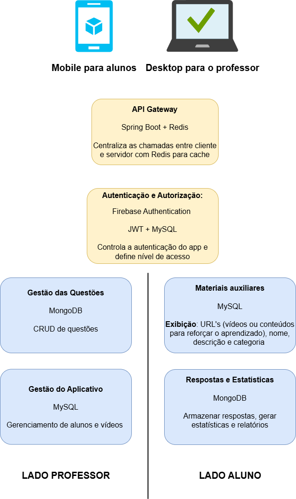
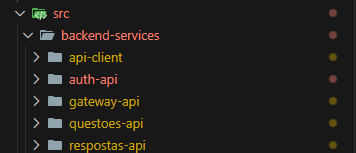

# Arquitetura da aplicação

## 🧩 Backend conforme o Diagrama

O **backend** será construído conforme o diagrama, usando arquitetura em camadas e serviços, organizando os componentes de acordo com os blocos descritos:



---

## 🧩 1. **API Gateway** (Spring Boot + Redis)

### Função

Centraliza todas as chamadas de cliente (mobile e desktop) para os microserviços.

### Tecnologias

- `Spring Boot`: Para criação da API Gateway.
- `Redis`: Para cache de requisições, melhorando performance.

### Etapas de implementação

1. Crie um projeto Spring Boot com dependência para:
   - Spring Cloud Gateway
   - Spring Security
   - Redis
2. Configure o Redis (`application.properties`) e implemente filtros para cache de respostas.
3. Crie rotas (`RouteLocator`) para redirecionar as requisições aos microserviços adequados (autenticação, questões, materiais, etc.).

---

## 🔐 2. **Autenticação e Autorização** (Firebase + JWT + MySQL)

### Função

Autenticar usuários via Firebase, e gerar tokens JWT para controle de acesso baseado em papéis (aluno/professor).

### Tecnologias

- `Firebase Authentication`: Para login (com e-mail, Google, etc.)
- `JWT`: Para gerar e verificar tokens no backend
- `MySQL`: Para persistência de informações do usuário e perfil

### Etapas

1. Configure o Firebase SDK no backend.
2. Após login no front-end, envie o `idToken` para o backend.
3. No backend, verifique o token com a lib do Firebase.
4. Gere um `JWT` com os dados do usuário e inclua o papel (aluno/professor).
5. Crie filtros do Spring Security para verificar esse token nas requisições.

---

## 📘 3. **Microserviços**

### A. Gestão das Questões (MongoDB)

- Tecnologias: Spring Boot + Spring Data MongoDB
- Endpoints:
  - `GET /questoes`
  - `POST /questoes`
  - `PUT /questoes/{id}`
  - `DELETE /questoes/{id}`

### B. Gestão do Aplicativo (MySQL)

- Para gerenciar:
  - Alunos
  - Vídeos disponíveis para os alunos
- Entidades:
  - `Aluno`, `Video`, `RelacionamentoAlunoVideo`
- Tecnologias: Spring Boot + Spring Data JPA

### C. Materiais Auxiliares (MySQL)

- Endpoints para CRUD de materiais com:
  - URL
  - Nome
  - Descrição
  - Categoria
- Tecnologias: Spring Boot + JPA + MySQL

### D. Respostas e Estatísticas (MongoDB)

- Armazena:
  - Respostas dos alunos
  - Estatísticas por usuário
  - Relatórios agregados
- Tecnologias: Spring Boot + MongoDB Aggregation

---

## ⚙️ 4. Integração dos Serviços

- Todos os microserviços devem expor endpoints REST protegidos via JWT.
- O API Gateway se comunica com eles via HTTP e autentica as requisições.
- Redis no gateway pode armazenar respostas frequentes (ex: lista de vídeos).

---

## 🔄 Exemplo de Fluxo Completo (Aluno acessa conteúdo)

1. Aluno faz login no app → Firebase retorna `idToken`.
2. Front envia `idToken` para o backend (autenticação).
3. Backend gera e retorna JWT.
4. Aluno acessa materiais: Front envia JWT no header.
5. API Gateway valida token e redireciona para microserviço de materiais.
6. Redis pode retornar do cache se disponível.
7. Resposta chega ao app.

---

### 🧠 Quantos apps criar no Heroku?

Se você está seguindo a arquitetura baseada no diagrama com microserviços, recomenda-se criar múltiplos apps no Heroku para isolar responsabilidades. Abaixo estão duas abordagens possíveis:

### 🧱 Opção 1: Arquitetura Modular (Microserviços)

| App                      | Descrição                                    | Tecnologia                         |
| ------------------------ | -------------------------------------------- | ---------------------------------- |
| `api-gateway`            | Centraliza chamadas entre cliente e servidor | Spring Boot + Redis                |
| `auth-service`           | Autentica usuários via Firebase e gera JWT   | Spring Boot + Firebase SDK + MySQL |
| `questoes-service`       | CRUD de questões                             | Spring Boot + MongoDB              |
| `materiais-service`      | Gestão de materiais auxiliares               | Spring Boot + MySQL                |
| `respostas-service`      | Armazena respostas e estatísticas dos alunos | Spring Boot + MongoDB              |
| `app-management-service` | Gerenciamento de alunos e vídeos             | Spring Boot + MySQL                |

#### Total: 6 apps

---

### ⚙️ Opção 2: Arquitetura Simplificada (Monolito Modular)

| App            | Contém                                                               |
| -------------- | -------------------------------------------------------------------- |
| `backend-api`  | Todos os serviços integrados em um único app Spring Boot             |
| `gateway`      | API Gateway isolado para tratar autenticação e redirecionamento      |
| `frontend-web` | Interface web do professor (pode ser hospedada no Netlify ou Vercel) |
| `mobile-app`   | Aplicativo React Native (hospedado via Expo ou empacotado como APK)  |

**Total: 2 a 4 apps**, com menos complexidade para planos gratuitos do Heroku.

---

### 💾 Banco de Dados

- **Redis**: Não disponível nativamente no Heroku gratuito. Use RedisToGo ou Upstash.
- **MongoDB**: Utilize o MongoDB Atlas (plano gratuito).
- **MySQL**: Utilize ClearDB (para MySQL) ou migre para PostgreSQL com ElephantSQL.

---

### ✅ Resumo Final

- **Ideal (microserviços)**: 6 apps (alta escalabilidade, deploys independentes).
- **Simplificado (monolito)**: 1 ou 2 apps backend + 1 frontend, mais simples e barato.
- **Frontend Mobile**: Não é hospedado no Heroku. Use Expo ou Play Store.

### Estrutura do repositório no GitHub




| **App no Heroku**        | **PROJECT_PATH**                         | **Descrição**                                  |
|--------------------------|-------------------------------------------|------------------------------------------------|
| `auth-api`               | `src/backend-services/auth-api`           | Serviço de autenticação e geração de JWT       |
| `gateway-api`            | `src/backend-services/gateway-api`        | API Gateway com Spring Cloud e Redis           |
| `questoes-api`           | `src/backend-services/questoes-api`       | CRUD de questões com MongoDB                   |
| `respostas-api`          | `src/backend-services/respostas-api`      | Armazenamento de respostas e estatísticas      |
| `api-client` *(opcional)*| `src/backend-services/api-client`         |  (se houver)|

Vamos utilizar um **monorepo com subpastas** dentro de `src/backend-services`.

## ✅ Para fazer o deploy de cada microserviço no Heroku:

Você deve configurar cada app Heroku com os seguintes ajustes:

### 📌 1. **Buildpacks** (em cada app Heroku)

1. Adicione primeiro:
   ```
   https://github.com/timanovsky/subdir-heroku-buildpack
   ```

2. Depois:
   ```
   heroku/java
   ```

> A ordem **importa**: o buildpack do subdiretório precisa vir **antes**.

---

### 📌 2. **Variável de ambiente `PROJECT_PATH`**

Em **Settings > Config Vars**, defina a variável `PROJECT_PATH` para apontar para a pasta do microserviço.

### ✅ Tabela de apps e paths:

| App Heroku               | Valor de `PROJECT_PATH`                 |
|--------------------------|-----------------------------------------|
| `auth-api`               | `src/backend-services/auth-api`         |
| `gateway-api`            | `src/backend-services/gateway-api`      |
| `questoes-api`           | `src/backend-services/questoes-api`     |
| `respostas-api`          | `src/backend-services/respostas-api`    |
| `api-client` (opcional)  | `src/backend-services/api-client`       |

---

### 📄 3. `Procfile` em cada pasta

Dentro de cada pasta (`auth-api`, `gateway-api`, etc.), crie um `Procfile` com:

```Procfile
web: java -Dserver.port=$PORT -jar target/*.jar
```

---

### 🚀 4. Deploy com GitHub

1. Para **cada app Heroku**, conecte ao **mesmo repositório** no GitHub.
2. O Heroku irá:
   - Clonar o repositório
   - Entrar na pasta definida por `PROJECT_PATH`
   - Rodar o `Procfile`
   - Fazer build com Maven e deploy

---

### 🧪 5. Teste com `heroku logs`

Após deploy, veja os logs com:

```bash
heroku logs --tail -a nome-do-app
```

## ⚠️ Importante

No Heroku, quando você usa o buildpack `subdir-heroku-buildpack`, ele entra na subpasta definida em `PROJECT_PATH` e procura o `Procfile` **lá dentro**.  
Se o `Procfile` estiver fora do diretório indicado, o Heroku **não conseguirá iniciar a aplicação**.
